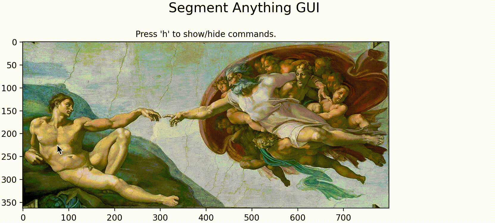

# Segment Anything GUI

A matplotlib GUI for interactive manual segmentation using the Segment Anything Model (SAM).

<div align=center>

</div>

## How to Get Started

There are two ways to access the GUI:

### 1. Online

[](https://colab.research.google.com/github/fsemerar/segment-anything-gui/blob/main/run.ipynb)
to run our Jupyter notebook and follow the instructions.

### 2. Locally

Clone the project:

    git clone https://github.com/fsemerar/segment-anything-gui.git
    cd segment-anything-gui

Create the conda environment suitable for your needs:

    # GPU-enabled
    conda env create --file env/environment_gpu.yml

    # CPU-only
    conda env create --file env/environment_cpu.yml

Run the following commands to install [Segment Anything](https://github.com/facebookresearch/segment-anything) and the gui:

    conda activate sam
    wget https://dl.fbaipublicfiles.com/segment_anything/sam_vit_h_4b8939.pth 
    pip install git+https://github.com/facebookresearch/segment-anything.git
    pip install -e .

Now you can run the GUI using:

    python run.py --input-img test.jpg --output-img tag.jpg

## Citation

If you find this work useful for your research or applications, please cite using this BibTeX:

```BibTeX
@software{samgui,
  author = {Semeraro, Federico and Quintart, Alexandre},
  year = {2023},
  title = {A simple GUI for the Segment Anything Model},
  url = {https://github.com/fsemerar/segment-anything-gui},
  version = {1.0.0},
  date = {2023-04-27},
}
```

## Acknowledgements

The project uses [Segment Anything](https://github.com/facebookresearch/segment-anything).
Many thanks to the authors for open-sourcing their efforts.

## License

The code is licensed under the MIT License. By contributing to this code, you agree to license your contributions
under the same license as the project. See LICENSE for more information.
